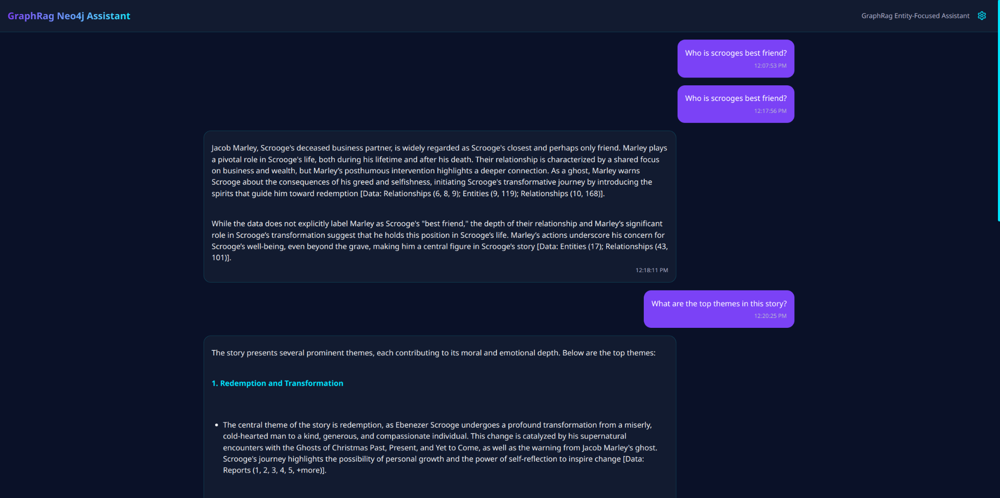
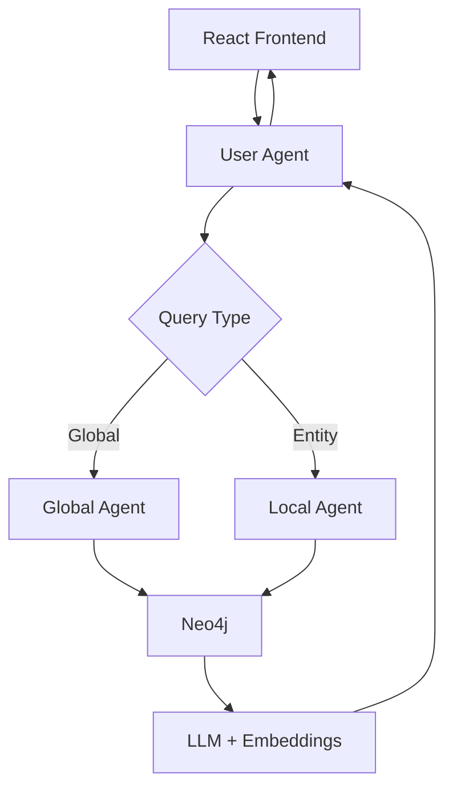

# GraphRAG Neo4j Assistant


A sophisticated system leveraging Graph-based Retrieval Augmented Generation (GraphRAG) with Neo4j and Azure OpenAI to provide context-aware answers through entity-focused or global knowledge graph exploration.



## Important Note

    - ** Indexing Guide:** Please refer to the `INDEXING.MD` file for detailed instructions on how to set up your Neo4j database and index your data.
    - ** Embedding Dimensions:** Ensure you set the correct dimensions for the `text-embedding-3-large` model in your settings.yml file. If you're using Azure OpenAI, you can use the default model.

## Features

- **Dual Search Modes**

  - **Global Assistant**: Broad conceptual analysis across the entire knowledge graph
  - **Entity-Focused Assistant**: Precision searches targeting specific entities and their relationships

- **Real-Time Chat Interface**

  - Interactive markdown-supported responses
  - Configurable Neo4j connection settings
  - Response history with timestamps

- **Agent-Based Architecture**
  - Autonomous agent routing based on query context
  - Scalable microservices architecture
  - Integration with Agentverse for service discovery

## Tech Stack

**Frontend**

- React + TypeScript
- Tailwind CSS
- Lucide React Icons

**Backend**

- Python 3.10+
- Flask/Quart (ASGI)
- LangChain
- Neo4j Driver

**AI/ML**

- Azure OpenAI (GPT-4) or OpenAI (GPT-4, text-embedding-3-large)
- Neo4j Vector Index
- Custom RAG Pipelines

**Infrastructure**

- uAgents Framework
- Agentverse Registration
- Docker Compatible

## Getting Started

### Prerequisites

- Neo4j 5.x+ instance
- Either Azure OpenAI **or** OpenAI API Key
- Python 3.10+ and Node.js 18+
- Agentverse API Key

### Installation

1. **Clone Repository**

   ```bash
   git clone https://github.com/your-username/graphrag-neo4j-assistant.git
   cd graphrag-neo4j-assistant
   ```

2. **Install Frontend Dependencies**

   ```bash
   cd frontend
   npm install
   ```

3. **Set Up Python Environment**

   ```bash
   python -m venv .venv
   source .venv/bin/activate  # Linux/MacOS
   .venv\Scripts\activate    # Windows
   pip install -r requirements.txt
   ```

4. **Configure Environment**  
   Create `.env` file with one of the following configurations:

#### ➤ **Option 1: Azure OpenAI Setup**

```ini
# Neo4j
NEO4J_URL=bolt://localhost:7687
NEO4J_USER=neo4j
NEO4J_PASSWORD=your_password

# Azure OpenAI
DEPLOYMENT_NAME=gpt-4
AZURE_OPENAI_API_KEY=your_key
DEPLOYMENT_NAME_EMBEDDINGS=text-embedding-ada-002

# Agentverse
AGENTVERSE_API_KEY=your_key
GLOBAL_AGENT_SECRET_KEY=global_secret
LOCAL_AGENT_SECRET_KEY=local_secret
USER_AGENT_SECRET_KEY=user_secret
```

#### ➤ **Option 2: OpenAI Setup (No Azure)**

```ini
# Neo4j
NEO4J_URL=bolt://localhost:7687
NEO4J_USER=neo4j
NEO4J_PASSWORD=your_password

# OpenAI
OPENAI_API_KEY=your_openai_key
OPENAI_MODEL=gpt-4
EMBEDDING_MODEL=text-embedding-3-large

# Agentverse
AGENTVERSE_API_KEY=your_key
GLOBAL_AGENT_SECRET_KEY=global_secret
LOCAL_AGENT_SECRET_KEY=local_secret
USER_AGENT_SECRET_KEY=user_secret
```

In your embedding code, make sure to specify the correct dimension for the `text-embedding-3-large` model:

```python
from langchain.embeddings import OpenAIEmbeddings

embeddings = OpenAIEmbeddings(
    model="text-embedding-3-large",
    dimensions=3072  # Required for this model
)
```

### Running the System

1. **Start Backend Services** (in separate terminals):

   ```bash
   # User Agent (Router)
   python user_agent.py

   # Global Search Agent
   python register_global_agent.py

   # Entity-Focused Agent
   python register_local_agent.py
   ```

2. **Launch Frontend**

   ```bash
   cd frontend
   npm run dev
   ```

3. **Access Interface**  
   Open `http://localhost:3000` in your browser

## Configuration Guide

### Neo4j Setup

1. Create vector index:

   ```cypher
   CREATE VECTOR INDEX `entity` IF NOT EXISTS
   FOR (n:__Chunk__)
   ON (n.embedding)
   OPTIONS {indexConfig: {
     `vector.dimensions`: 1536,
     `vector.similarity_function`: 'cosine'
   }}
   ```

2. Load your knowledge graph data using Neo4j Data Importer

### Agent Configuration

| Service      | Port | Environment Variables Required |
| ------------ | ---- | ------------------------------ |
| User Agent   | 5005 | USER_AGENT_SECRET_KEY          |
| Global Agent | 5002 | GLOBAL_AGENT_SECRET_KEY        |
| Local Agent  | 5003 | LOCAL_AGENT_SECRET_KEY         |

## API Documentation

### Key Endpoints

**User Agent (5005)**

- `GET /api/search-agents` - Discover available agents
- `POST /api/send-data` - Route query to appropriate agent
- `GET /api/get-response` - Retrieve processed response

**Global Agent (5002)**

- `POST /webhook` - Handle global knowledge queries

**Local Agent (5003)**

- `POST /webhook` - Process entity-focused queries

## Architecture



## Troubleshooting

**Common Issues**

- **Connection Errors**: Verify Neo4j credentials and firewall rules
- **Agent Registration Failures**: Check Agentverse API key validity
- **Empty Responses**: Ensure knowledge graph contains relevant data
- **Timeout Errors**: Increase polling attempts in `App.tsx`
- **Embedding Dimension Errors**: Ensure `text-embedding-3-large` uses `dimensions=3072`

## License

MIT License - See [LICENSE](LICENSE) for details

## Contributing

1. Fork the repository
2. Create feature branch (`git checkout -b feature/improvement`)
3. Commit changes (`git commit -am 'Add new feature'`)
4. Push to branch (`git push origin feature/improvement`)
5. Open Pull Request

---

**Note**: Before deploying to production, ensure proper security measures for API endpoints and consider adding authentication layers.

---
